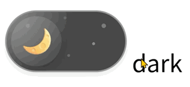

# Theme Switch / 主题切换器

> An elegant animated theme switcher with moon/sun toggle  
> 一个优雅的动画主题切换器，带有月亮/太阳切换效果

## Language / 语言选择

- [🇺🇸 English](#english)
- [🇨🇳 中文](#中文)



---

## 中文

### 概述

一个使用纯 HTML 和 CSS 构建的美观交互式主题切换器组件。具有流畅动画、装饰元素和直观的月亮/太阳切换设计。

**所有样式均以 kasukabetsumugi-开头，避免干扰已有样式**，你可以按照需要改成自己喜欢的。

### ✨ 特性

- **纯 CSS 实现**: 无需 JavaScript 框架依赖
- **流畅动画**: 使用 cubic-bezier 缓动函数实现自然运动
- **交互元素**:
  - 带有渐变背景的月亮和太阳图标
  - 暗色模式下的闪烁星星
  - 明亮模式下的浮动云朵
  - 带有发光效果的旋转太阳射线
- **响应式设计**: 在不同屏幕尺寸下完美缩放
- **可自定义**: CSS 自定义属性便于主题定制
- **无障碍**: 正确的标签关联和键盘导航

### 🎨 视觉效果

- **暗色模式**: 展示月亮图标配合闪烁星星背景
- **明亮模式**: 显示太阳图标配合浮动云朵和旋转射线
- **悬停效果**: 微妙的光照效果增强用户交互体验
- **平滑过渡**: 所有元素在状态间平滑动画

### 🚀 使用方法

只需把 html 文件里的所有 style 内容和 下方的 label（需注意 label 的 `for`属性要和 input 的 `id` 一样，方能奏效） 复制到你的 html 中就可以生效：

```html
<label for="theme" class="kasukabetsumugi-theme-switch">
  <input type="checkbox" id="theme" name="theme" class="kasukabetsumugi-dummy" />
  <div class="kasukabetsumugi-moon">
    <div class="kasukabetsumugi-icon"></div>
  </div>
  <div class="kasukabetsumugi-sun">
    <div class="kasukabetsumugi-icon"></div>
  </div>
  <div class="kasukabetsumugi-stars">
    <div class="kasukabetsumugi-star"></div>
    <div class="kasukabetsumugi-star"></div>
    <div class="kasukabetsumugi-star"></div>
    <div class="kasukabetsumugi-star"></div>
    <div class="kasukabetsumugi-star"></div>
  </div>
  <div class="kasukabetsumugi-clouds">
    <div class="kasukabetsumugi-cloud"></div>
    <div class="kasukabetsumugi-cloud"></div>
    <div class="kasukabetsumugi-cloud"></div>
  </div>
</label>
```

### 🎛️ 自定义配置

组件使用 CSS 自定义属性便于定制：

```css
.kasukabetsumugi-theme-switch {
  --kasukabetsumugi-base: 20px; /* 基础尺寸单位 */
  --kasukabetsumugi-emoji-size: 20px; /* 图标大小 */
  --kasukabetsumugi-border: 1px; /* 边框宽度 */
  --kasukabetsumugi-pad: 2px; /* 内部填充 */
}
```

### 📋 浏览器支持

- 支持 CSS Grid 和自定义属性的现代浏览器
- Chrome 49+
- Firefox 31+
- Safari 9.1+
- Edge 16+

### 📄 许可证

MIT 许可证 - 可自由用于您的项目！

---

## English

### Overview

A beautiful and interactive theme switcher component built with pure HTML and CSS. Features smooth animations, decorative elements, and an intuitive moon/sun toggle design.

**Every style starts with kasukabetsumugi- to avoid conflicts with existing styles**. You can change it to your preferred naming convention as needed.

### ✨ Features

- **Pure CSS Implementation**: No JavaScript framework dependencies
- **Smooth Animations**: Cubic-bezier easing functions for natural motion
- **Interactive Elements**:
  - Moon and sun icons with gradient backgrounds
  - Twinkling stars in dark mode
  - Floating clouds in light mode
  - Rotating sun rays with glow effect
- **Responsive Design**: Scales beautifully across different screen sizes
- **Customizable**: CSS custom properties for easy theming
- **Accessible**: Proper label associations and keyboard navigation

### 🎨 Visual Effects

- **Dark Mode**: Features a moon icon with twinkling stars background
- **Light Mode**: Shows a sun icon with floating clouds and rotating rays
- **Hover Effects**: Subtle lighting effects enhance user interaction
- **Smooth Transitions**: All elements animate smoothly between states

### 🚀 Usage

Simply copy all the style content from the HTML file and the label below (note that the label's `for` attribute must match the input's `id` for it to work properly) into your HTML:

```html
<label for="theme" class="kasukabetsumugi-theme-switch">
  <input type="checkbox" id="theme" name="theme" class="kasukabetsumugi-dummy" />
  <div class="kasukabetsumugi-moon">
    <div class="kasukabetsumugi-icon"></div>
  </div>
  <div class="kasukabetsumugi-sun">
    <div class="kasukabetsumugi-icon"></div>
  </div>
  <div class="kasukabetsumugi-stars">
    <div class="kasukabetsumugi-star"></div>
    <div class="kasukabetsumugi-star"></div>
    <div class="kasukabetsumugi-star"></div>
    <div class="kasukabetsumugi-star"></div>
    <div class="kasukabetsumugi-star"></div>
  </div>
  <div class="kasukabetsumugi-clouds">
    <div class="kasukabetsumugi-cloud"></div>
    <div class="kasukabetsumugi-cloud"></div>
    <div class="kasukabetsumugi-cloud"></div>
  </div>
</label>
```

### 🎛️ Customization

The component uses CSS custom properties for easy customization:

```css
.kasukabetsumugi-theme-switch {
  --kasukabetsumugi-base: 20px; /* Base size unit */
  --kasukabetsumugi-emoji-size: 20px; /* Icon size */
  --kasukabetsumugi-border: 1px; /* Border width */
  --kasukabetsumugi-pad: 2px; /* Internal padding */
}
```

### 📋 Browser Support

- Modern browsers with CSS Grid and Custom Properties support
- Chrome 49+
- Firefox 31+
- Safari 9.1+
- Edge 16+

### 📄 License

MIT License - feel free to use in your projects!

**Created with ❤️ by [Kasukabe Tsumugi](https://github.com/baendlorel)**
